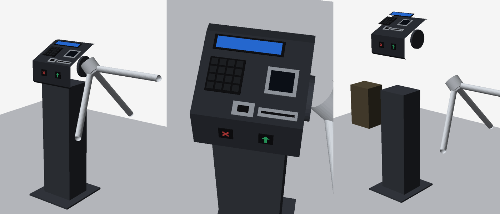

# 33 — Gêmeo digital da TopFit 4

> A catraca em 3D dentro do painel: o operador gira, aproxima, clica nas peças, vê o que
> cada uma faz **neste sistema** e assiste aos cenários da operação. No modo ao vivo o
> desenho acompanha a catraca real. **Nada disto foi visto rodando numa tela Windows ainda:**
> a CI compila e testa a lógica; o desenho só aparece no Windows com tela (ver seção 8).



*Prévia renderizada fora do WPF, só com a geometria (sem o brilho e as luzes da tela).*

## 1. De onde veio o pedido, e o que mudou

O pedido original (prompt gerado no ChatGPT) supunha **Java, JavaFX e jMonkeyEngine**. O
XAcess é **C# / .NET 10 com WPF** (ADR-0012, ADR-0019). Então:

| Pedido | O que foi feito | Por quê |
|---|---|---|
| jMonkeyEngine / PBR | **Viewport3D do WPF**, materiais difuso + especular + emissivo | Nenhum pacote novo (NuGetAudit quebra o build por dependência), roda na máquina modesta do evento |
| Nova máquina de estados `OFFLINE…URN_FULL` | **Cena visual** (`CenaDaCatraca`) que resume a `DeviceStateMachine` real | A máquina real já existe no worker; duplicá-la criaria duas verdades |
| `SimulationTurnstileAdapter` / `TopdataTurnstileAdapter` | Já existem: `src/Simulator` e `Topdata.EasyInner.Adapter` | O gêmeo não fala com catraca nenhuma: fala com o serviço, pelo IPC, como toda tela |
| Event bus novo | O fluxo `AcompanharEventos` que o Painel ao vivo já usa | Uma fonte só de eventos |
| Botões "Recolher cartão", "Urna cheia", "Dois sentidos", facial | Aparecem, com o selo **Aguardando confirmação** ou **Fora do escopo** | Mesma regra da tela Gerenciar catraca (docs/32, seção 5): nada de fingir |

## 2. O que a tela faz

- **Desenho 3D:** arrastar gira, roda aproxima, clique escolhe a peça, duplo clique mira nela.
  Setas e +/− no teclado fazem o mesmo; a lista de peças à direita escolhe sem mouse.
- **Vistas prontas:** inicial, frente, painel, braços, trás, cima. A câmera vai suave, sem
  quique (aproximação exponencial).
- **Peças separadas:** tampa sobe, braços saem, o depósito da urna aparece.
- **Ficha da peça:** o que faz, cada função com o selo *Disponível / Aguardando confirmação /
  Não usada aqui / Fora do escopo*, e em que tela se ajusta.
- **Cenários (demonstração):** QR válido, código desconhecido, liberada sem giro, cartão na
  urna, cartão da bilheteria na frente, liberação manual, queda de comunicação, urna cheia.
  Cada passo tem uma frase e acende a peça de que fala.
- **Na simulada:** com o serviço em modo simulação, o botão passa o código de teste do cenário
  na catraca simulada (o mesmo `SimularLeitura` da tela Simulador) e o gêmeo muda para ao
  vivo, mostrando o que o sistema decidiu de verdade. Fora da simulação o serviço recusa.
- **Display:** prévia do texto em 2 × 16, com aviso de palavra cortada entre as linhas (e
  quantos espaços pôr), de texto acima de 32 caracteres e de acento. "Ver no display 3D" só
  muda o desenho.
- **Ao vivo:** escolhe a catraca; cada acesso gravado vira leitura → decisão → giro no
  desenho. Sem notícia da catraca, o display apaga. **O gêmeo não comanda nada.**

O selo no alto do desenho diz sempre de onde vem o que se vê: *DEMONSTRAÇÃO* ou
*AO VIVO · CATRACA NN*.

## 3. Arquitetura

```
Telas/Gemeo.xaml(.cs)           desenho, câmera, mouse — nenhuma regra
        │  Quadro() a cada frame; PropertyChanged para vista e foco
        ▼
GemeoDigitalViewModel           modos, cenários, prévia, fluxo ao vivo (sem WPF, testável em Linux)
        │
        ├── CenaDaCatraca       máquina de estados visual, pura: o instante vem de fora
        ├── Roteiros            os cenários, passo a passo, com a narração
        ├── TraducaoAoVivo      EventoDeAcesso → acontecimentos da cena
        ├── CatalogoDaFit4      fichas das peças e a situação real de cada função
        ├── Display2x16         como 32 caracteres viram duas linhas de 16
        └── GeometriaFit4       a catraca em malhas neutras (Malha), a partir de fit4.json
                │
                └── EspecificacaoDaFit4 ← GemeoDigital/fit4.json (embutido)
```

Regras que os testes seguram:
- **Nunca dois giros ao mesmo tempo.** Giro que chega durante outro entra na fila.
- **Decisão espera a leitura ser mostrada**: o operador vê leu → decidiu → liberou, na ordem.
- **Liberado sem giro não conta**, igual à prestação de contas (ADR-0007).
- **Queda no meio do giro** termina o giro onde estava; não existe meio giro desenhado.
- **Leitor desconhecido não é inventado:** sem a origem, a leitura aparece sem celular nem cartão.

## 4. O modelo 3D

Desenhado por código (`GeometriaFit4`): caixas, cilindros, esferas e um prisma para a cabeça
com a frente inclinada. Eixos: X da coluna para os braços, Y para cima, Z para a frente;
milímetros.

O mecanismo é um **tripé de verdade**: o eixo desce inclinado (45°) e os três braços saem num
cone em volta dele, de modo que um fica sempre na horizontal fechando a passagem. Um terço de
volta leva cada braço ao lugar do próximo — há teste para isso, e para o sentido da entrada
(o braço de cima vai para trás, como quem empurra vindo da frente).

**Para trocar por um modelo do Blender** (`fit4.glb`): os objetos precisam ter os nomes que
`GeometriaFit4` usa (`Base`, `Coluna`, `Tampa`, `Flange`, `Cubo`, `Braco01..03`,
`DisplayMoldura`, `DisplayTela`, `TecladoBase`, `Teclas`, `QrMoldura`, `QrJanela`,
`ProxPlaca`, `ProxSimbolo`, `UrnaMoldura`, `UrnaFenda`, `UrnaDeposito`, `LiberadoFundo`,
`LiberadoSeta`, `BloqueadoFundo`, `BloqueadoXis`, `FacialCorpo`, `FacialTela`), com o pivô
do rotor no centro do cubo. A tela só lê `ModeloDaFit4`; um leitor de glTF que produza o
mesmo `ModeloDaFit4` troca o desenho sem mexer em ViewModel, cena ou testes. O WPF não lê
glTF sozinho: isso exige um pacote novo, e fica para quando houver o arquivo.

## 5. Medidas

Em `src/Desktop.ViewModels/GemeoDigital/fit4.json`. **A confirmar:** vêm de material comercial
da Topdata (variante Facial: 300 × 1342 × 250 mm sem os braços), não de fonte primária, e as
medidas internas (altura do eixo, comprimento do braço, cabeça) são estimadas pelas fotos. A
tela diz isso embaixo do desenho enquanto `fonteDasMedidas` começar com `A_CONFIRMAR`.

**Na bancada:** medir altura total, altura do eixo, comprimento e diâmetro do braço, e a
inclinação do eixo; corrigir o JSON e trocar `fonteDasMedidas`.

As fotos de referência usadas para a disposição das peças (perfil da catraca e o painel com
facial, display, teclado, QR e proximidade) são material comercial da Topdata e **não estão no
repositório**, que é público.

**Cores.** As do objeto físico (pintura, inox, teclas, luzes da cena, display) também estão no
`fit4.json`, em `aparencia`: a catraca é a mesma em qualquer tema, e a regra do projeto é
não ter cor solta em tela. O que depende do tema — o realce da peça, o verde e o vermelho
acesos, a urna cheia — vem das chaves Rayzer (`Rayzer.Brand.Cyan`, `Rayzer.Access.Granted`,
`Rayzer.Access.Denied`, `Rayzer.Warning`).

## 6. Acessibilidade

- Tudo o que o mouse faz no desenho tem caminho pelo teclado (lista de peças, botões de vista,
  setas e +/− com o desenho focado).
- O estado da catraca desenhada está também em texto (`RayzerStatus`, com leitor de tela
  avisando a mudança), e a narração do cenário é uma lista, não só animação.
- Cor nunca sozinha: verde e vermelho do desenho têm seta e X; o estado tem texto.

## 7. Limitações conhecidas

- **Ao vivo, o giro chega junto com a decisão.** O fluxo manda cada tentativa quando ela é
  gravada; se o giro ainda não aconteceu, o desenho mostra "liberada" e volta a travar depois
  da espera pelo giro, sem mostrar o giro que veio depois. Resolveria: o serviço difundir
  também a confirmação da passagem (um campo a mais em `EventoDeAcesso`, ou um segundo evento
  com o mesmo `evento_id`).
- **A origem ao vivo só existe para tentativas novas.** Desde a Etapa 0.3 do docs/35, a
  origem bruta de cada leitura é gravada com a tentativa (`ticket_use_attempt.reader_origin`,
  migração 010) e o serviço preenche `origem_bruta`, `origem_conhecida` e
  `origem_desconhecida` (QR 21, frente 2, urna 3). Tentativas gravadas antes da migração não
  têm origem e continuam aparecendo sem o objeto (exceto "use a fenda da urna", deduzido do
  motivo).
- **Urna cheia ao vivo** só aparece quando o serviço mandar a origem 20.
- **Liberação manual e mensagem temporária** feitas em Gerenciar catraca não passam pelo
  fluxo de acessos: o desenho ao vivo não as mostra.
- **Transparência** (a pessoa genérica) no WPF depende da ordem de desenho; vista de alguns
  ângulos ela pode cobrir a catraca de um jeito estranho. É só um objeto de cena.

## 8. Como conferir no Windows

1. Instale ou rode o painel em modo simulação (docs/23).
2. Abra **Gêmeo digital** no menu.
3. Rode cada cenário; em "QR válido", confira: celular chega, verde acende, braço gira um
   terço para trás, display volta à mensagem padrão.
4. Marque **Ao vivo**, e na tela **Simulador** passe `1000000001` na catraca 1: o desenho
   precisa ler, liberar e girar.
5. Arraste, role, clique no display, no leitor de QR e nos braços; teste as vistas e as peças
   separadas; troque o tema claro/escuro.
6. Deixe o gêmeo aberto 10 minutos e confira no Gerenciador de Tarefas que a memória não
   cresce.

O autoteste do painel (`--autoteste`) já passa por esta tela nos dois temas.

## 9. Testes

- `tests/Unit/GemeoDigital/CenaDaCatracaTests.cs` — a máquina visual: fila de giros, ordem
  leitura → decisão, negação de 3 s, liberação sem giro, queda de comunicação, relógio que volta.
- `tests/Unit/GemeoDigital/GeometriaFit4Tests.cs` — faces para fora, braço horizontal, um
  terço de volta leva cada braço ao próximo, sentido da entrada, texto do display de pé,
  proporções, nomes únicos, variante sem urna.
- `tests/Unit/GemeoDigital/GemeoDigitalTests.cs` — display 2 × 16, especificação, catálogo
  (o que não existe aparece como aguardando), todos os cenários terminam com a catraca livre,
  códigos de teste existem no `simulacao.exemplo.json`, tradução do fluxo ao vivo.
- `tests/Integration/TelasTests.cs` — a ViewModel contra o serviço de verdade.
- `tests/Integration/LigacoesDasTelasTests.cs` — toda ligação do XAML aponta para propriedade
  que existe.
